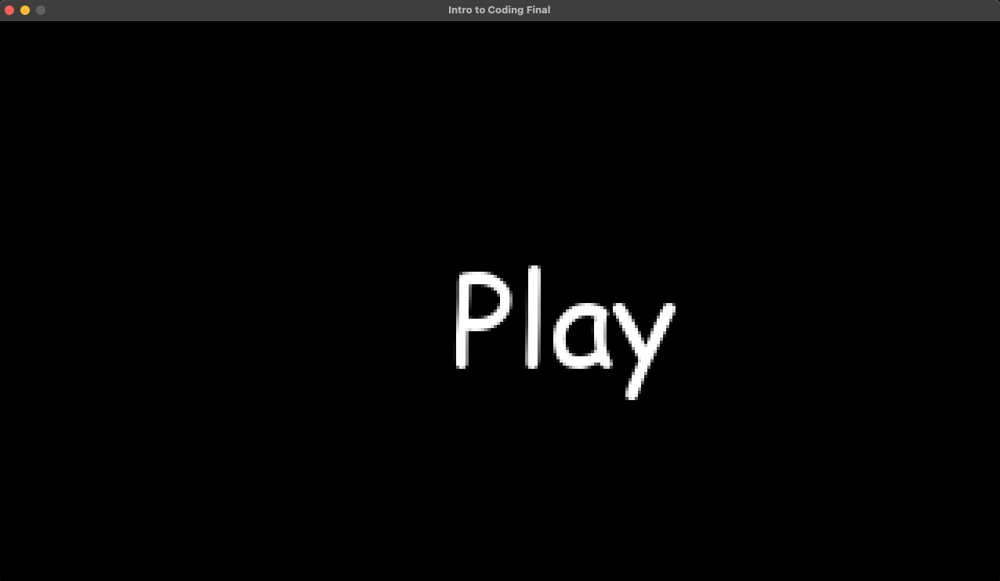

#Final Project Documentation

##Basics
I fist started off with doing some things I knew how to do. I opened game maker and I created a new sprite for a block and the player. These are probably going to be demo sprites just so I can get all the mechanics of the game working. I made the block 16 x 16 pixels and the charter 10 x 16. 

I then needed to make objects for the player and the block. Sprites are just the graphics but objects can have code and interact with the game and the player. I did not have to put any code into the block object because all of the collision happens in the Player object. 

Inside the player object I first made a create event. Events in game maker are just basically eiether if statments or when code happens in order. The create event is there so it will be code that runs once the object is ran in the game world before any other code, then it doesnt repeat the code again. Inside of this event I did this code.
```
window_set_size(1280, 720);
xsp = 0
ysp = 0
```
The window size code is used to make the size of the window that you are playing the game in. This could be put somewhere better like an object in the tilte screen but for now I am putting it in the character object for ease. xsp and ysp are variables to represnt x axis speed and y axis speed. This is used for when you make use keys on the keyboard to make the player object move a certain amount of pixels every frame. I set them at zero to start because we dont want the character to move when you first open the game. 

Next I created a step event. Step events run every frame so this is where you put stuff that will be happening throughout the game. This is the code I used.
```
ysp += 0.1
xsp = 0

if keyboard_check(vk_left)
{
	xsp = -1
}

if keyboard_check(vk_right)
{
	xsp = 1
}

if place_meeting(x, y+0.1, obj_block)
{
	ysp = 0
	if keyboard_check(vk_up)
	{
		ysp = -2
	}
}

move_and_collide(xsp, ysp, obj_block)
```
ysp +=0.1 is basically making gravity so the player will fall .1 pixel every frame if not touching a block. I used the keyboard check code to make the left and right key change the xsp. The place_meeting code is used so that if the player is touching a block the gravity stops so they dont fall through the block and if the player hits the up key while touching a block there gravity will change so they will go up like a jump. move_and_collide is a built in game maker command that uses the xsp and ysp variables I made to move the object in space. 

After that I used the room window to throw together some blocks just to test that everything was working. I ran into an issue where the game was really blurry but I remembered that in the settings you turn off interpolation and it makes it look good again. Other than that everything was working as expected. 

##More
I made an emeny sprite which is a smily face. I could not figure out how to make the enemy move towards the player so I used chat gpt. 


I then put the enemy in the room with the player and it did follow but it was way too fast so I changed the speed from 2 to 1. Then I wanted to make it so that when you get hit by the emeny it sends you to a death screen that says "You Suck". I made a new room in game maker with an object in it that would display the string of text. I could not figure out how to make it display so I looked in the game maker manual but I still couldnt figure it out. I used chat gpt and the answer was alot more obvious than I thought.


Once I got the text working I set up an alarm (which is just a timer) so that after a short time it would go back to the title screen. I did this using this code
```
alarm_set(0, 120)

room_goto(r_titleScreen)
```
The 0 in the alarm set line refers to which alarm you are using and the 120 refers to 120 frames to wait. Then in the title screen window I made a play button object with this code and it did not work
```
draw_set_color(c_white)
draw_set_font(ft_comicSans)

draw_text(x, y, "Play")

if move_and_collide(mouse_x, mouse_y, obj_playButton) && mouse_button
{
	room_goto(r_titleScreen)
}
```

I was trying to make it so that when the mouse is touching the play button and you click it, then it goes to the game room. First error I noticed was that I made it go to the title screen again which would never bring you to the game. I then looked at the game maker manual and tried this and it still did not work.
```
if move_and_collide(mouse_x, mouse_y, obj_playButton) && mouse_check_button(mb_left)
{
	room_goto(Room1)
}
```
Then I remembered that I should be using the place meeting code instead of move and collide. I did this code which at least displayed the play button but nothing happened when I clicked it. 
```
if place_meeting(mouse_x, mouse_y, obj_playButton) && mouse_check_button(mb_left)
{
	room_goto(Room1)
}
```

I then did more digging in the manual and found that I should be using ```position_meeting``` instead of ```place_meeting``` because place is more for in game things and not ui. This made it work as intended. 

##Making a projectile
I imediatly turned to the game maker manual for this. I wanted to be able to point and shoot a projectile from the player so you can destory an enemy. I found that I should use ```instane_create_layer()``` so I started with this code.
```
if mouse_check_button(mb_left)
{
	instance_create_layer(obj_Player.x, obj_Player.y, "Projectile_Layer", obj_projectile)
}
```
This made it so when i cliked left clike the projectile object would be created where the player is standing. The issues I fist noticed were that there was no limit to how fast I could create the projectiles and it obviously was not pointing to wherever the mouse was. 


Suprisingly I was able to fix the issue of how fast I could create projectiles myself just with the use of variables and sphaggehti code. 
```
projectileCoolDownTimer = 60
projectileCooledDown = true


if projectileCooledDown = false
{
	projectileCoolDownTimer --
}
if projectileCoolDownTimer <= 0
{
	projectileCooledDown = true
	projectileCoolDownTimer = 60
}

if mouse_check_button(mb_left) && projectileCooledDown
{
	projectileCooledDown = false
	instance_create_layer(obj_Player.x, obj_Player.y, "Projectile_Layer", obj_projectile)
}
```
This made it so that there is a 60 frame or 1 second cool down between each click so that you can only shoot once a second. I used the -- to make the value go down 1 every frame. 

I then tried to make the projectile point in the direction of the mouse. First I tried ```point_direction(x, y, mouse_x, mouse_y)``` which would be similar to the logic of the enemey object. There was a line under the code which in game maker usually means the code wouldnt run so I didnt even try it. I asked chat gpt. 


This did not help me at all. I then tried running the game just to see and suprisingly it did run but it was not pointing towards the mouse. I then realized that I should just do it exactly like the enemy object is handled but istead of putting the direction code in the step event I need to put it into the create event. This would make the direction code run once when the object is made instead of every frame which would make it follow the mouse. 

I also needed the enemy to get destroyed if the projectile hit the enemy. I couldnt use ```if place_meeting(x, y, obj_enemy)``` because that refers to all instances of the object, not the specific one on the screen at the current moment. I remembered from using game maker in the past I needed to use ```instance_place``` because that gives you a unique id but I couldnt remember how to use it. I looked in the game maker manual and could out I had to do 
```
var _inst = instance_place(x, y, obj_Enemy);
if (_inst != noone)
{
    hp -= _inst.dmg;
    instance_destroy(_inst);
}
```
In the end my code for the projectile ended up being this. 
```
dir = point_direction(x, y, mouse_x, mouse_y)

motion_set(dir, 5)

hit = instance_place(x, y, obj_enemy)

if hit
{
	instance_destroy(hit)
	instance_destroy()
}
```
##Extras
Since making the projecticle wasnt as hard as I thought it would be, I wanted to add a few more things to make this a game someone could actually play. The first thing I wanted to do was make the enemys spawn periodically and after you kill so many of them they will start to spawn faster and faster. I also wanted them to spawn in 3 different posistions on the map. I grindined this part out without doccumenting alot but through a lot of syntax errors and looking at the game maker manual I made this sphagetti code for the game room to make all this happen. 
```
startTimer = 80
startTimerRan = false
enemyTimer = 300
enemyTimerActivated = false
enemyspawncount = 0
right = 0
middle = 0.5
left = 1
spawnSide = right
spawnSidex = 48
spawnSidey = 16
turnDone = false


if spawnSide == left
{
	spawnSidex = 48
	spawnSidey = 16
}
if spawnSide == middle
{
	spawnSidex = 160
	spawnSidey = 16
}
if spawnSide == right
{
	spawnSidex = 272
	spawnSidey = 16
}


if startTimer > 0
{
	startTimer --
}
if startTimer <= 0 && startTimerRan == false
{
	instance_create_layer(spawnSidex, spawnSidey, "Instances_1", obj_enemy)
	enemyTimerActivated = true
	spawnSide = middle
	enemyspawncount++
	startTimerRan = true
}


if enemyTimerActivated
{
	if enemyTimer > 0
	{
		turnDone = false
		enemyTimer --
	}
	if enemyTimer <= 0
	{
		if enemyspawncount <= 4
		{
			enemyTimer = 300
		}
		else if enemyspawncount > 4 && enemyspawncount < 9
		{
			enemyTimer = 240
		}
		else if enemyspawncount > 8 && enemyspawncount < 13
		{
			enemyTimer = 180
		}
		else if enemyspawncount > 12 && enemyspawncount < 17
		{
			enemyTimer = 120
		}
		else
		{
			enemyTimer = 60
		}
		if spawnSide == right && !turnDone
		{
			spawnSide = middle
			turnDone = true
		}
		if spawnSide == middle && !turnDone
		{
			spawnSide = left
			turnDone = true
		}
		if spawnSide == left && !turnDone
		{
			spawnSide = right
			turnDone = true
		}
		instance_create_layer(spawnSidex, spawnSidey, "Instances_1", obj_enemy)
		enemyspawncount ++
	}
}
```
I also added a new enemy so there is a little more you have to keep track of during the game. This is the code for the new enemy. 
```
alarm_set(0, 900)

if x > 160
{
speed = -1
}
if x < 0
{
	speed = 1
}
```
This is the final code for the room object so that the new enemy would spawn properly. 
```
startTimer = 80
startTimerRan = false
enemyTimer = 300
enemyTimerActivated = false
enemyspawncount = 0
right = 0
middle = 0.5
left = 1
spawnSide = right
spawnSidex = 48
spawnSidey = 16
turnDone = false


enemyTimer2 = 200
right2 = 0
left2 = 1
spawnSide2 = right2
spawnSidex2 = 320
spawnSidey2 = 144


if spawnSide == left
{
	spawnSidex = 48
	spawnSidey = 16
}
if spawnSide == middle
{
	spawnSidex = 160
	spawnSidey = 16
}
if spawnSide == right
{
	spawnSidex = 272
	spawnSidey = 16
}
if spawnSide2 == left2
{
	spawnSidex2 = -16
	spawnSidey2 = 144
}
if spawnSide2 == right2
{
	spawnSidex2 = 320
	spawnSidey2 = 144
}


if startTimer > 0
{
	startTimer --
}
if startTimer <= 0 && startTimerRan == false
{
	instance_create_layer(spawnSidex, spawnSidey, "Instances_1", obj_enemy)
	enemyTimerActivated = true
	spawnSide = middle
	enemyspawncount++
	startTimerRan = true
}


if enemyTimerActivated
{
	if enemyTimer > 0
	{
		turnDone = false
		enemyTimer --
	}
	if enemyTimer <= 0
	{
		if enemyspawncount <= 4
		{
			enemyTimer = 300
		}
		else if enemyspawncount > 4 && enemyspawncount < 9
		{
			enemyTimer = 240
		}
		else if enemyspawncount > 8 && enemyspawncount < 13
		{
			enemyTimer = 180
		}
		else if enemyspawncount > 12 && enemyspawncount < 17
		{
			enemyTimer = 120
		}
		else
		{
			enemyTimer = 60
		}
		if spawnSide == right && !turnDone
		{
			spawnSide = middle
			turnDone = true
		}
		if spawnSide == middle && !turnDone
		{
			spawnSide = left
			turnDone = true
		}
		if spawnSide == left && !turnDone
		{
			spawnSide = right
			turnDone = true
		}
		instance_create_layer(spawnSidex, spawnSidey, "Instances_1", obj_enemy)
		enemyspawncount ++
	}
}
	
	
	

if enemyTimer2 > 0
{
	enemyTimer2 --
	if enemyTimer2 <= 0
	{
		enemyTimer2 = 200
		instance_create_layer(spawnSidex2, spawnSidey2, "Instances_1", obj_enemy2)
		if spawnSide2 == left2
		{
			spawnSide2 = right2
		}
		else
		{
			spawnSide2 = left2
		}
	}
}
```
I then added this code to make a song play throughout the game. 
```
audio_play_sound(Song, 1, true)
```

I also tried to add a timer that would save your best time of how long you were able to survive but it was too complicated and I couldnt figure it out so I guess you have to use your imagination. 

Also I am finding out just now that in order to export the game from game maker on mac you have to purchase a apple developer account. I hope it is ok I am not turning the game itself in and it is sufficient enough to see the readme along with the presentation. 